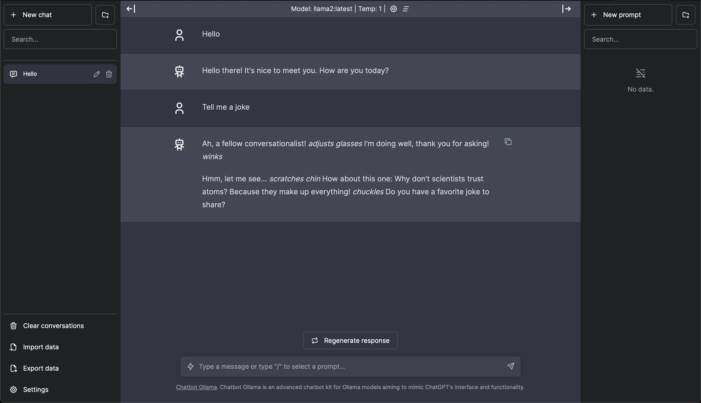
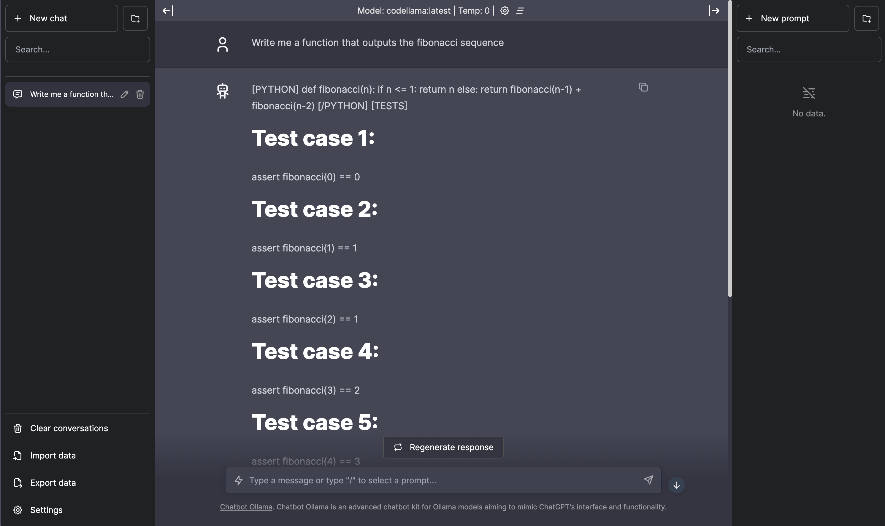

# 🦙 Ollama locally





## ✅ Prerequisites

You will need Docker and Docker Compose installed on your machine. You can find instructions on how to install them [here](https://docs.docker.com/get-docker/).

## 🚀 Getting started

1. Clone this repository and `cd` into it.
    ```bash
    git clone https://github.com/rfdez/ollama-locally.git && cd ollama-locally
    ```
2. Start the project with the following command:
    ```bash
    # Start the project
    docker compose up -d

    # Stop the project
    docker compose down --remove-orphans

    # Stop the project and remove all data
    docker compose down --remove-orphans --volumes
    ```
    It will take a while the first time you run it, as it needs to download the Docker images.
3. You have to download the model you want to use. Run the following command to download the `llama2` model:
    ```bash
    docker compose exec ollama ollama pull llama2
    ```
    It will take a while the first time you run it, as it needs to download the model.
4. You can now access the Ollama Chat at [http://localhost:3000](http://localhost:3000).

> **💡 Note:** If you want to use a different model, you can run `docker compose exec ollama ollama pull <model_name>` to download it and then change the ollama model in the Chat interface. You can find a list of available models [here](https://ollama.ai/models).

## 📚 References

- [Ollama](https://ollama.ai)
- [Ollama GitHub repository](https://github.com/ollama/ollama)
- [Ollama Chat GitHub repository](https://github.com/ivanfioravanti/chatbot-ollama)
